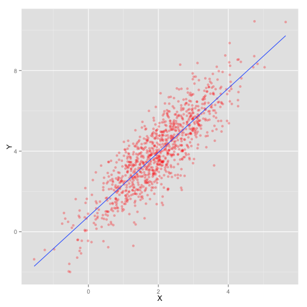

---
title       : Review - Data Science Model
subtitle    : 智庫驅動
author      : 廖尹禎 (Dboy Liao)
job         : qmalliao@gmail.com
framework   : io2012-dsp
highlighter : highlight.js  # {highlight.js, prettify, highlight}
hitheme     : zenburn      # 
widgets     : [mathjax]            # {mathjax, quiz, bootstrap}
mode        : selfcontained
knit        : slidify::knit2slides

--- .largecontent


## About Me

- 畢業於臺大經濟研究所。
- 當研究助理期間，因研究需求，一頭兒栽進 R 的世界。
- DSP 2015 R Tutorial 講者群之一。
- 現在是業餘程式愛好者，喜歡把看過的理論模型用程式實現。
- 時常出沒於 ML/DM Monday 等技術社群。

--- .largecontent

## Model

- 如何建一個 model?

--- .largecontent

## Model

- 如何建一個 model?
  - 量化問題、提出假設。
  - 觀察資料。
  - 實作。

--- .largecontent

## Model

<font size=6>
OK...所以怎樣才是個"好" Model?
</font>

<font size=6 color='orange'>
你/妳的答案:
</font>


--- .largecontent

## Linear Model

$$
  Y = X \beta + \varepsilon, \varepsilon \sim N(0, \sigma^2I)
$$

<center>
<font size=6pt>
or
</font>
</center>

$$
\begin{aligned}
y_i &= \beta_0 + \beta_1 x_{i,1} + \cdots + \beta_n x_{i,n} + \varepsilon_i \\
i &= 1, \dots, m \\
\varepsilon_i &\sim N(0, \sigma^2) \\
\end{aligned}
$$


--- .largecontent

## Linear Model

$$
  Y = X \beta + \varepsilon, \varepsilon \sim N(0, \sigma^2I)
$$

<br/>

- $Y$: 被解釋變數。也就是我們的研究對象。


--- .largecontent

## Linear Model

$$
  Y = X \beta + \varepsilon, \varepsilon \sim N(0, \sigma^2I)
$$

<br/>

- $Y$: 被解釋變數。也就是我們的研究對象。
- $X$: 解釋變數。也就是我們認為會"影響" $Y$ 的變量。


--- .largecontent

## Linear Model

$$
  Y = X \beta + \varepsilon, \varepsilon \sim N(0, \sigma^2 I)
$$

<br/>

- $Y$: 被解釋變數。也就是我們的研究對象。
- $X$: 解釋變數。也就是我們認為會"影響" $Y$ 的變量。
- 什麼樣的"影響"呢? 這個模型跟資料的關係又是...?
  - 我們做了什麼假設?

--- .largecontent

## Linear Model - Explained

- 對線性模型左右同取期望值:
  $$
    E[Y|X] = X\beta
  $$

--- .largecontent

## Linear Model - Explained

- 對線性模型左右同取期望值:
  $$
    E[Y|X] = X\beta
  $$
- $\varepsilon$ 消失了。(因為我們"假設"其期望值為 0)

--- .largecontent

## Linear Model - Explained

- 對線性模型左右同取期望值:
  $$
    E[Y|X] = X\beta
  $$
- $\varepsilon$ 消失了。(因為我們"假設"其期望值為 0)
- $Y$ 的"期望值" (平均值) 與 $X$ 呈現線性關係 ($\beta$)。

--- .largecontent

## Linear Model - Explained

- 使用線性模型時，我們希望:
  - $Y$ 的平均值與 $X$ 呈線性關係
  - 誤差的平均值接近 0 


--- .largecontent

## 圖形

- 數學講完了，那在資料中，又是呈現什麼樣子呢?

--- .largecontent

## 圖形

- 數學講完了，那在資料中，又是呈現什麼樣子呢?
- 我們來看一些例子。

--- .largecontent

## 圖形

- $\varepsilon \sim N(0, 1^2)$


```r
# 產生資料
X <- matrix(rnorm(1000, 2), 1000, 1)
beta_true <- matrix(c(0.73, 1.6), 2, 1)
Y <- cbind(rep(1, 1000), X) %*% beta_true + rnorm(1000)
data_ok <- data.frame(Y = Y, X = X)
```

--- .largecontent


```r
# 畫圖
ggplot(data_ok, aes(x = X, y = Y)) + geom_point(colour="red", alpha = .3)
```

 

--- .largecontent

## 圖形

- $\varepsilon \sim N(0, 3^2)$


```r
# 產生資料
X <- matrix(rnorm(1000, 2), 1000, 1)
beta_true <- matrix(c(0.73, 1.6), 2, 1)
Y <- cbind(rep(1, 1000), X) %*% beta_true + rnorm(1000, sd = 3)
data <- data.frame(Y = Y, X = X)
```

--- .largecontent


```r
# 畫圖
ggplot(data, aes(x = X, y = Y)) + geom_point(colour="red", alpha = .3)
```

 

--- .largecontent

## 圖形

- $\varepsilon \sim N(0, 5^2)$


```r
# 產生資料
X <- matrix(rnorm(1000, 2), 1000, 1)
beta_true <- matrix(c(0.73, 1.6), 2, 1)
Y <- cbind(rep(1, 1000), X) %*% beta_true + rnorm(1000, sd = 5)
data_noisy <- data.frame(Y = Y, X = X)
```

--- .largecontent


```r
# 畫圖
ggplot(data_noisy, aes(x = X, y = Y)) + geom_point(colour="red", alpha = .3)
```

 

--- .largecontent

### Noise 對模型的影響


```r
summary(fit_ok)
```

```
## 
## Call:
## lm(formula = Y ~ X, data = data_ok)
## 
## Residuals:
##    Min     1Q Median     3Q    Max 
## -3.496 -0.646 -0.010  0.679  3.358 
## 
## Coefficients:
##             Estimate Std. Error t value Pr(>|t|)    
## (Intercept)   0.7574     0.0685    11.1   <2e-16 ***
## X             1.5904     0.0306    52.0   <2e-16 ***
## ---
## Signif. codes:  0 '***' 0.001 '**' 0.01 '*' 0.05 '.' 0.1 ' ' 1
## 
## Residual standard error: 0.98 on 998 degrees of freedom
## Multiple R-squared:  0.73,	Adjusted R-squared:  0.73 
## F-statistic: 2.7e+03 on 1 and 998 DF,  p-value: <2e-16
```

--- .largecontent

### Noise 對模型的影響


```r
summary(fit_noisy)
```

```
## 
## Call:
## lm(formula = Y ~ X, data = data_noisy)
## 
## Residuals:
##     Min      1Q  Median      3Q     Max 
## -14.959  -3.203  -0.079   3.313  14.359 
## 
## Coefficients:
##             Estimate Std. Error t value Pr(>|t|)    
## (Intercept)    1.116      0.334    3.35  0.00085 ***
## X              1.399      0.147    9.51  < 2e-16 ***
## ---
## Signif. codes:  0 '***' 0.001 '**' 0.01 '*' 0.05 '.' 0.1 ' ' 1
## 
## Residual standard error: 4.75 on 998 degrees of freedom
## Multiple R-squared:  0.0832,	Adjusted R-squared:  0.0822 
## F-statistic: 90.5 on 1 and 998 DF,  p-value: <2e-16
```


--- .largecontent

## Linear Model - Dummy Variable

- $X$ 如果是類別變數呢? 跟 $Y$ 的關係又是如何?

--- .largecontent

## Linear Model - Dummy Variable

- $X$ 如果是類別變數呢? 跟 $Y$ 的關係又是如何?
- 統計學上使用 `dummy variable` 來處理這樣的變數。

--- .largecontent

## Linear Model - Dummy Variable

- $X$ 如果是類別變數呢? 跟 $Y$ 的關係又是如何?
- 統計學上使用 `dummy variable` 來處理這樣的變數。
- `dummy variable` 是值為 `0` 或 `1` 的隨機變數。

--- .largecontent

## Dummy Variable -- Explained

- 如果 $X$ 是 `dummy variable`，對我們的 linear model 有什麼樣的影響呢?


--- .largecontent

## Dummy Variable -- Explained

- 如果 $X$ 是 `dummy variable`，對我們的 linear model 有什麼樣的影響呢?
- 給定:

$$
    y_i = \beta_0 + \beta_1 x_{i,1} + \varepsilon
$$

--- .largecontent

## Dummy Variable -- Explained

- 取期望值:

$$
  E[y_i | x_{i, 1}] = \beta_0 + \beta_1 x_{i,1}
$$

--- .largecontent

## Dummy Variable -- Explained

- 當 $x_{i, 1}=0$:

$$
  E[y_i|x_{i, 1}=0] = \beta_0
$$

--- .largecontent

## Dummy Variable -- Explained

- 當 $x_{i, 1}=1$:

$$
  E[y_i | x_{i, 1}=1] = \beta_0 + \beta_1
$$

--- .largecontent

## Dummy Variable -- Explained

- $y_i$ 在 $x_{i, 1}$ 是 `1` 或 `0` 時，期望值會有 $\beta_1$ 的差距。


--- .largecontent

## Dummy Variable -- Explained

- $y_i$ 在 $x_{i, 1}$ 是 `1` 或 `0` 時，期望值會有 $\beta_1$ 的差距。
- 也就是說，我們應該可以從圖形上發現，不同群體 ($x_{i, 1}$ 是 `0` 與 `1`) 間 $y_i$ 的平均值應該要有差異。


--- .largecontent

## Dummy Variable -- Explained

- $y_i$ 在 $x_{i, 1}$ 是 `1` 或 `0` 時，期望值會有 $\beta_1$ 的差距。
- 也就是說，我們應該可以從圖形上發現，不同群體 ($x_{i, 1}$ 是 `0` 與 `1`) 間 $y_i$ 的平均值應該要有差異。
- 讓我們來看一些例子吧!


--- .largecontent

## 圖形

- $\varepsilon \sim N(0, 1^2)$


```r
X <- matrix(rbinom(1000, 1, 0.5), 1000, 1)
beta_true <- matrix(c(1.1, 5.8), 2, 1)
Y <- cbind(rep(1, 1000), X) %*% beta_true + rnorm(1000, sd = 1)
data <- data.frame(Y = Y, X = ifelse(X == 1, "P", "N"))
```


--- .largecontent


```r
ggplot(data, aes(x = Y, fill = X)) + geom_bar(alpha = .4, binwidth = .5)
```

 


--- .largecontent

## 圖形

- $\varepsilon \sim N(0, 3^2)$


```r
X <- matrix(rbinom(1000, 1, 0.5), 1000, 1)
beta_true <- matrix(c(1.1, 5.8), 2, 1)
Y <- cbind(rep(1, 1000), X) %*% beta_true + rnorm(1000, sd = 3)
data <- data.frame(Y = Y, X = ifelse(X == 1, "P", "N"))
```


--- .largecontent


```r
ggplot(data, aes(x = Y, fill = X)) + geom_bar(alpha = .4, binwidth = .5)
```

 


--- .largecontent

## 圖形

- $\varepsilon \sim N(0, 5^2)$


```r
X <- matrix(rbinom(1000, 1, 0.5), 1000, 1)
beta_true <- matrix(c(1.1, 5.8), 2, 1)
Y <- cbind(rep(1, 1000), X) %*% beta_true + rnorm(1000, sd = 5)
data <- data.frame(Y = Y, X = ifelse(X == 1, "P", "N"))
```


--- .largecontent


```r
ggplot(data, aes(x = Y, fill = X)) + geom_bar(alpha = .4, binwidth = .5)
```

 

--- .largecontent

## 觀察資料

- 根據剛剛的數學分析與例子，我們可以歸納出以下幾個觀查資料的重點:


--- .largecontent

## 觀察資料

- 根據剛剛的數學分析與例子，我們可以歸納出以下幾個觀查資料的重點:
  - $X$ 與 $Y$ 是否呈線性? ($X$ 是數值變數)
  - $Y$ 的平均值在不同 $X$ 下是否有差異? ($X$ 是類別變數)
  - 高次項的影響? ($Y$ 與 $X$ 不是單純線性關係)
  - 圖形可能受誤差項的標準差影響，需透過模型驗證。

--- .largecontent

## 補充: 變數選取小撇步

- $X$ v.s $2X$ (共線性問題)
- 變數獨立性 (等等看圖說明)

--- .largecontent

## 補充: 變數選取小撇步

- 譬如說，我們想知道年齡與身高的關係。
- $X_1$ 是身高(公分)
- $X_2$ 是身高(公尺)
- 把 $X_1$ 與 $X_2$ 同時放進 Linear Model 裡會有什麼效果呢?

--- .largecontent

## 補充: 變數選取小撇步

$$
\begin{aligned}
y_i =& \beta_0 + \beta_1 x_{1, i} + \beta_2 x_{2, i} \\
    =& \beta_0 + \beta_1 100 x_{2, i} + \beta_2 x_{2, i} \\
    =& \beta_0 + (100\beta_1 + \beta_2)x_{2, i} \\
\end{aligned}
$$

--- .largecontent

## 補充: 變數選取小撇步

- 有放 $X_1$ 跟沒放一樣。
- 會造成運算結果的錯誤。
  - 因為 covariance matrix 不是 full-ranked (給懂線性代數的朋友)
- 百害而無一利。
- 避免放入有強烈線性關係的變數!

--- .largecontent

## 實作

- 用 `read.table` 讀進 data


```r
sales_data <- read.table("demo_data.csv", sep=',')
```

--- .largecontent

## 實作

- 看一下讀進來的結果


```r
head(sales_data)
```

```
##      V1         V2   V3   V4                     V5      V6       V7    V8
## 1 Store       Date Time Dept                 Family Item_No SalesQty Price
## 2    H1 01/01/2009   09   GA \xb9B\xb0ʶ\xbc\xae\xc6     254        3    24
## 3    H1 01/01/2009   09   GA \xb9B\xb0ʶ\xbc\xae\xc6     654        3    19
## 4    H1 01/01/2009   09   GA \xb9B\xb0ʶ\xbc\xae\xc6     876        5    14
## 5    H1 01/01/2009   10   GA \xb9B\xb0ʶ\xbc\xae\xc6     186        5     9
## 6    H1 01/01/2009   11   GA \xb9B\xb0ʶ\xbc\xae\xc6     876        5    14
##           V9          V10          V11
## 1 SalesValue Sales_Status Sales_number
## 2         72            N            1
## 3         57            P            1
## 4         70            P            1
## 5         45            P            1
## 6         70            P            1
```


--- .largecontent

## 實作

- 編碼出問題了。
- 簡單的方法可以用 `read.table` 中的 `fileEncoding` 參數解決。

--- .largecontent


```r
sales_data <- read.table("demo_data.csv", sep = ',', fileEncoding = 'big5',
                         header = T, stringsAsFactors = F)
```

```r
head(sales_data)
```

```
##   Store       Date Time Dept   Family Item_No SalesQty Price SalesValue
## 1    H1 01/01/2009    9   GA 運動飲料     254        3    24         72
## 2    H1 01/01/2009    9   GA 運動飲料     654        3    19         57
## 3    H1 01/01/2009    9   GA 運動飲料     876        5    14         70
## 4    H1 01/01/2009   10   GA 運動飲料     186        5     9         45
## 5    H1 01/01/2009   11   GA 運動飲料     876        5    14         70
## 6    H1 01/01/2009   12   GA 運動飲料     654        1    29         29
##   Sales_Status Sales_number
## 1            N            1
## 2            P            1
## 3            P            1
## 4            P            1
## 5            P            1
## 6            P            1
```


--- .largecontent

## 實作

<font size=7 color=orange>用 Unix/Linux 的人有福了:</font>
- 用 `iconv` 處理編碼。(`big5 --> utf8`)


```r
system("iconv -f big5 -t utf8 demo_data.csv > demo_data_utf8.csv")
```

--- .largecontent

## 實作

- 用 Windows 的就....拜託用 Unix/Linux 的人幫忙一下吧。
- 或者你可以參考這邊的[資料](http://dbaportal.eu/2012/10/24/iconv-for-windows/)來安裝 Windows 版的 `iconv`。

--- .largecontent

## 實作

- 再重新讀一次


```r
sales_data <- read.table("demo_data_utf8.csv", sep = ",", header=T, stringsAsFactors = F)
head(sales_data)
```

```
##   Store       Date Time Dept   Family Item_No SalesQty Price SalesValue
## 1    H1 01/01/2009    9   GA 運動飲料     254        3    24         72
## 2    H1 01/01/2009    9   GA 運動飲料     654        3    19         57
## 3    H1 01/01/2009    9   GA 運動飲料     876        5    14         70
## 4    H1 01/01/2009   10   GA 運動飲料     186        5     9         45
## 5    H1 01/01/2009   11   GA 運動飲料     876        5    14         70
## 6    H1 01/01/2009   12   GA 運動飲料     654        1    29         29
##   Sales_Status Sales_number
## 1            N            1
## 2            P            1
## 3            P            1
## 4            P            1
## 5            P            1
## 6            P            1
```

--- .largecontent

## 資料整理/視覺化套件

- dplyr (`pipe`)
- ggplot2
- GGally (`ggpairs`)
- [demo.R](https://raw.githubusercontent.com/dspim/A2_LinearModel_Review/gh-pages/demo.R)

